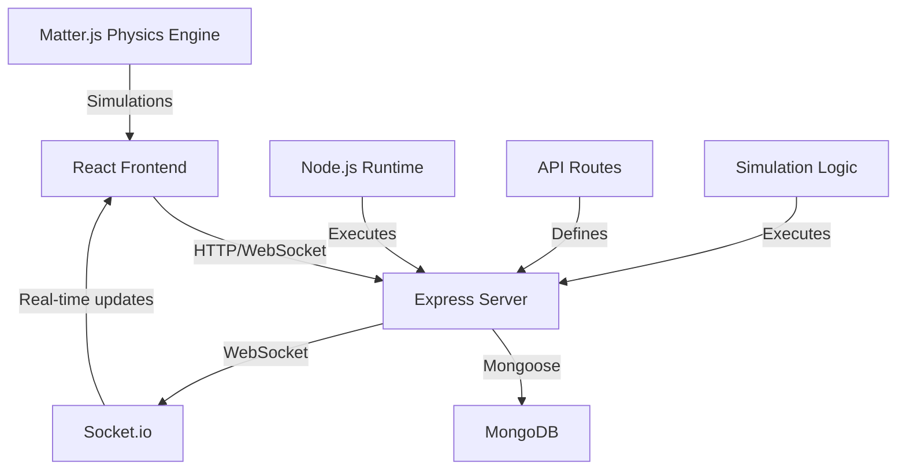

```mermaid
graph TD
    A[React Frontend] -->|HTTP/WebSocket| B[Express Server]
    B -->|Mongoose| C[MongoDB]
    B -->|WebSocket| D[Socket.io]
    D -->|Real-time updates| A
    E[Node.js Runtime] -->|Executes| B
    F[Matter.js Physics Engine] -->|Simulations| A
    G[API Routes] -->|Defines| B
    H[Simulation Logic] -->|Executes| B
```
