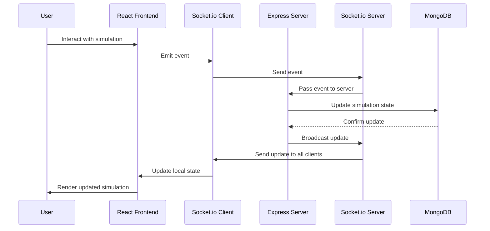

```mermaid
sequenceDiagram
    participant U as User
    participant R as React Frontend
    participant S as Socket.io Client
    participant E as Express Server
    participant SI as Socket.io Server
    participant M as MongoDB

    U->>R: Interact with simulation
    R->>S: Emit event
    S->>SI: Send event
    SI->>E: Pass event to server
    E->>M: Update simulation state
    M-->>E: Confirm update
    E->>SI: Broadcast update
    SI->>S: Send update to all clients
    S->>R: Update local state
    R->>U: Render updated simulation
```
