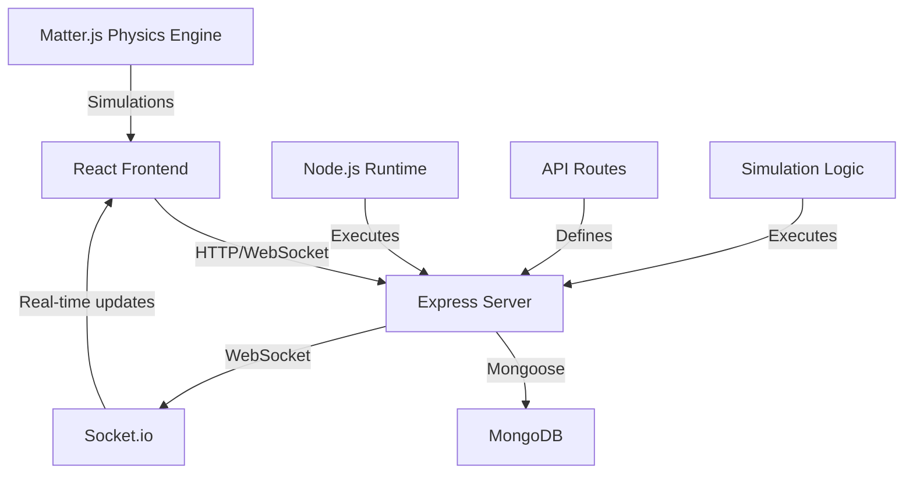
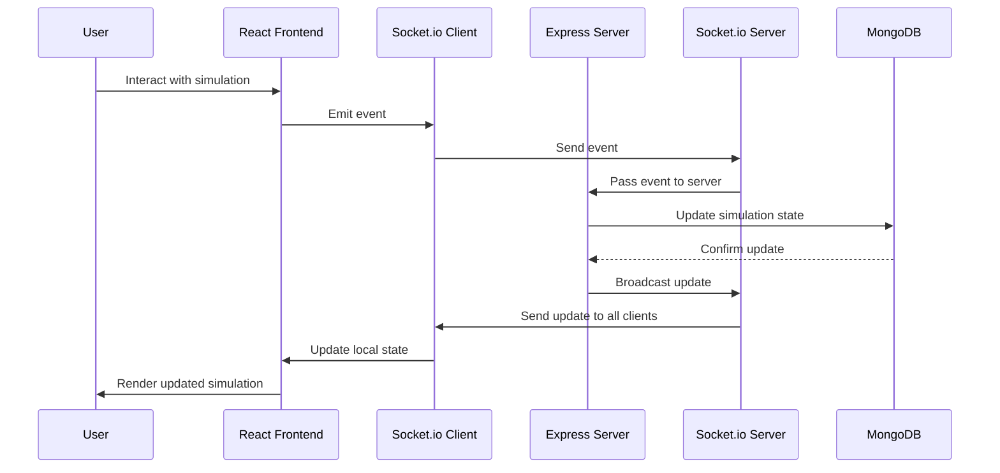

# Libraries for Interactive 2D Physics Simulation Playground

## Backend
- express: Web application framework
- mongoose: MongoDB object modeling tool
- socket.io: Real-time bidirectional event-based communication
- cors: Cross-Origin Resource Sharing middleware
- dotenv: Environment variable management
- body-parser: Parsing middleware for incoming request bodies

## Frontend
- react: UI library
- react-dom: React rendering for web
- matter-js: 2D physics engine for the web
- react-matter-js: React components for matter-js
- socket.io-client: Client-side socket.io
- axios: HTTP client for API requests
- styled-components: CSS-in-JS styling
- react-icons: Icon components for React

## Development
- nodemon: Auto-restart server during development
- concurrently: Run multiple commands concurrently
- eslint: Linting utility
- prettier: Code formatting
- jest: Testing framework
- react-testing-library: Testing utilities for React

## Architucture

## Data Flow

